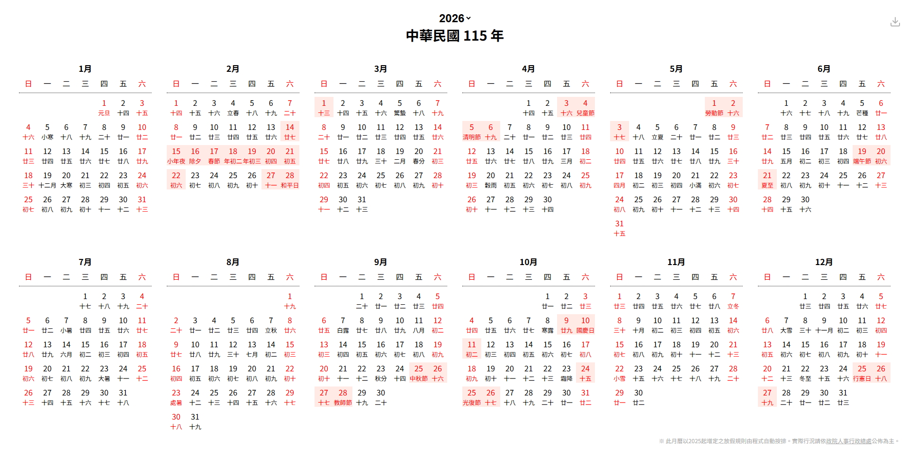
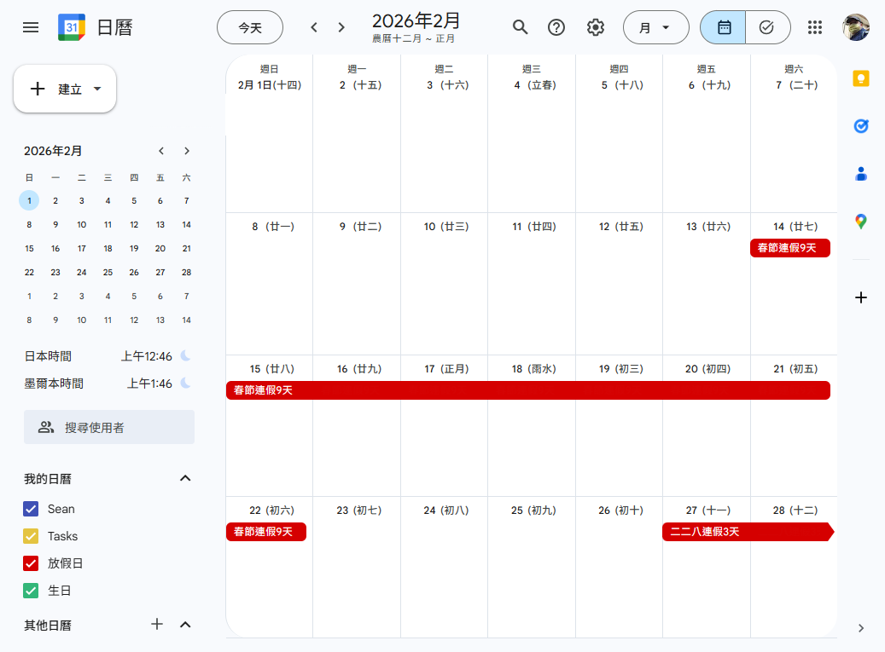

# 台灣連假萬年曆

1. 此為前端網頁程式。單一 html 檔，可完全離線使用。
2. 內容包含：1900-2100農曆、廿四節氣、農曆節日、國曆節日、連假及補放假
2. 右上角可下載該年 ics 檔 (可料匯入 Google 日曆)。
3. 此月曆以 2025 起增定之放假規則由程式自動按排，並非[行政院人事行政總處](https://www.dgpa.gov.tw/informationlist?uid=30)公佈實際放假情形。

## 線上展示

https://sean-web.web.app/taiwan-long-holidays-calendar.html

## 執行畫面

## 可匯入 Google 日曆

## 參考資料
香港天文台《[公曆與農曆日期對照表](https://www.hko.gov.hk/tc/gts/time/conversion1_text.htm)》
